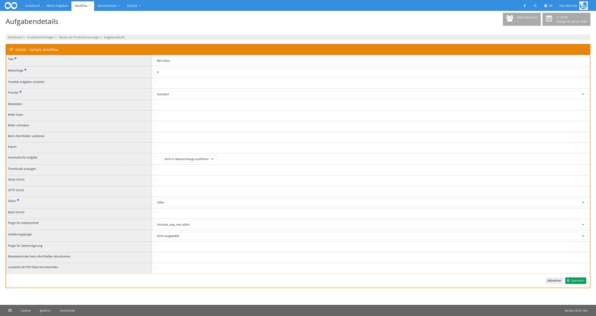

## Einführung

Dieses Plugin ermöglicht die Bearbeitung von MEI-XML in der Weboberfläche sowie die zeitgleiche Darstellung des XML in Verovio.

## Installation

Um das Plugin nutzen zu können, müssen folgende Dateien installiert werden:

```bash
/opt/digiverso/goobi/plugins/step/plugin-step-mei-editor-base.jar
/opt/digiverso/goobi/plugins/GUI/plugin-step-mei-editor-gui.jar
/opt/digiverso/goobi/config/plugin_intranda_step_mei_editor.xml
```

Nach der Installation des Plugins kann dieses innerhalb des Workflows für die jeweiligen Arbeitsschritte ausgewählt und somit automatisch ausgeführt werden. Dies erfolgt wie im folgenden Screenshot aufgezeigt durch Auswahl des Plugins `intranda_step_mei_editor` aus der Liste der installierten Plugins:



## Überblick und Funktionsweise

Bei Betreten des Plugins wird die für den jeweiligen Vorgang gefundene MEI-XML-Datei geladen und in eine Codemirror-Instanz geladen. Unterhalb dieser findet sich der Verovio-Render des aktuellen MEI-XML. Diese Darstellung übernimmt valide Änderungen im MEI-XML automatisch.

Verovio bietet die Möglichkeit, das MEI-XML als MIDI oder MEI herunterzuladen. Darüber hinaus kann das dargestellte Stück auch als MIDI abgespielt werden.

Die Bildanzeige links kann entweder ein Einzelbild oder eine konfigurierbare Vorschaubildanzeige präsentieren.

Die Änderungen können mit dem "Speichern"-Button übernommen werden. "Ergebnisse speichern und Aufgabe abschließen" speichert die aktuelle Fassung des MEI-XML und schließt die Aufgabe ab.

## Konfiguration

Die Konfiguration des Plugins erfolgt in der Datei `plugin_intranda_step_ZZZ.xml` wie hier aufgezeigt:

```xml
<config_plugin>

    <config>
        <!-- which projects to use for (can be more then one, otherwise use *) -->
        <project>*</project>
        <step>*</step>

        <!-- display button to finish the task directly from within the entered plugin -->
        <allowTaskFinishButtons>true</allowTaskFinishButtons>

        <!-- Image display options -->
        <!-- Default thumbnail size in px -->
        <thumbnailSize>200</thumbnailSize>

        <!-- Available thumbnail sizes for dropdown (optional) -->
        <!-- If not specified, defaults to: 100, 200, 300, 400 -->
        <thumbnailSizes>100</thumbnailSizes>
        <thumbnailSizes>150</thumbnailSizes>
        <thumbnailSizes>200</thumbnailSizes>
        <thumbnailSizes>300</thumbnailSizes>
        <thumbnailSizes>400</thumbnailSizes>

    </config>

</config_plugin>
```

Die Parameter innerhalb dieser Konfigurationsdatei haben folgende Bedeutungen:

Parameter               | Erläuterung
------------------------|------------------------------------
| `project` | Dieser Parameter legt fest, für welches Projekt der aktuelle Block `<config>` gelten soll. Verwendet wird hierbei der Name des Projektes.|
| `step` | Dieser Parameter steuert, für welche Arbeitsschritte der Block `<config>` gelten soll. Verwendet wird hier der Name des Arbeitsschritts. |
`allowTaskFinishButtons` | Dieser Parameter legt fest, ob der "Speichern und Aufgabe abschließen"-Button angezeigt werden soll.
`thumbnailSize` | Dieser Parameter legt die ursprüngliche Größe der dargestellten Thumbnails (in Pixeln) fest.
`thumbnailSizes` | Dieser Parameter legt fest, welche Thumbnailgrößen zur Auswahl stehen sollen. Dieser Parameter kann mehrfach im `<config>` Block vorkommen.

Über die Pluginkonfiguration hinaus muss in der `goobi_config.properties` der Pfad zum MEI-XML innerhalb des Metadatenverzeichnisses der jeweiligen Vorgänge definiert werden:

```properties
process.folder.misc.mei={processtitle}_mei
```

Bei der Verwendung des MEI Export-Plugins muss dieser Pfad mit dem dort definierten Quellpfad für das MEI-XML übereinstimmen.

Sollte im Betrieb der Fall auftreten, dass vorgenommene Änderungen nicht gespeichert werden, jedoch weder der Client noch der Server dabei eine Fehlermeldung ausgeben, liegt dies möglicherweise daran, dass die übermittelte XML-Datei zu groß ist und von Tomcat abgewiesen wird. In diesem Fall muss in der `server.xml` der relevante Connector (im Regelbetrieb für Port `8080`) um das Attribut `maxPostSize` ergänzt werden. Der Wert muss entweder ausreichend groß sein, oder kann auf `-1` gesetzt werden, um das Ablehnen von Requests aufgrund ihrer Größe komplett zu vermeiden.

```xml=server.xml
<Connector
    port="8080"
    protocol="HTTP/1.1"
    maxPostSize="-1" />
```
