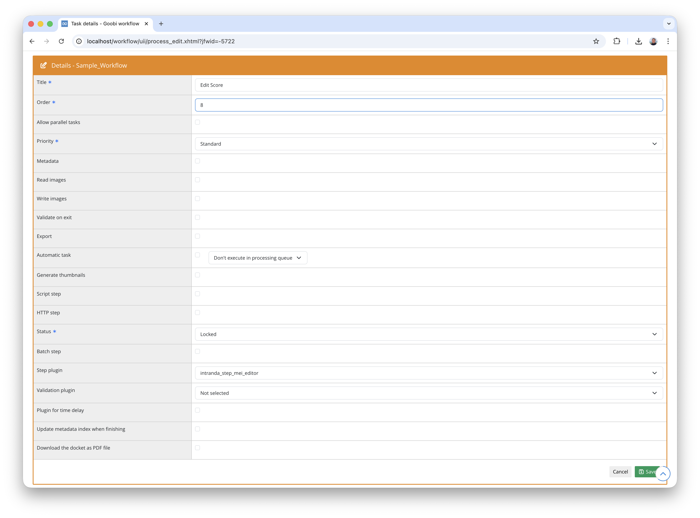

## Introduction

This plugin enables the editing of MEI XML in the web interface and the simultaneous display of the XML in Verovio.

## Installation

To use the plugin, the following files must be installed:

```bash
/opt/digiverso/goobi/plugins/step/plugin-step-mei-editor-base.jar
/opt/digiverso/goobi/plugins/GUI/plugin-step-mei-editor-gui.jar
/opt/digiverso/goobi/config/plugin_intranda_step_mei_editor.xml
```

Once the plugin has been installed, it can be selected within the workflow for the respective work steps and thus executed automatically. As shown in the following screenshot, this is done by selecting the plugin `intranda_step_mei_editor` from the list of installed plugins:



## Overview and functionality

When the plugin is launched, the MEI XML file found for the respective process is loaded and loaded into a Codemirror instance. Below this is the Verovio render of the current MEI XML. This display automatically incorporates valid changes in the MEI XML.

Verovio offers the option of downloading the MEI-XML as MIDI or MEI. In addition, the piece displayed can also be played as MIDI.

The image display on the left can show either a single image or a configurable preview image display.

The changes can be applied by clicking the "Save" button. "Save results and complete task" saves the current version of the MEI-XML and completes the task.

## Configuration

The plugin is configured in the file `plugin_intranda_step_ZZZ.xml` as shown here:

```xml
<config_plugin>

    <config>
        <!-- which projects to use for (can be more than one, otherwise use *) -->
        <project>*</project>
        <step>*</step>

        <!-- display button to finish the task directly from within the entered plugin -->
        <allowTaskFinishButtons>true</allowTaskFinishButtons>

        <!-- Image display options -->
        <!-- Default thumbnail size in px -->
        <thumbnailSize>200</thumbnailSize>

        <!-- Available thumbnail sizes for dropdown (optional) -->
        <!-- If not specified, defaults to: 100, 200, 300, 400 -->
        <thumbnailSizes>100</thumbnailSizes>
        <thumbnailSizes>150</thumbnailSizes>
        <thumbnailSizes>200</thumbnailSizes>
        <thumbnailSizes>300</thumbnailSizes>
        <thumbnailSizes>400</thumbnailSizes>

    </config>

</config_plugin>
```

The parameters within this configuration file have the following meanings:

Parameter               | Explanation
------------------------|------------------------------------
| `project` | This parameter specifies the project to which the current `<config>` block should apply. The name of the project is used here.|
| `step` | This parameter controls the work steps to which the `<config>` block should apply. The name of the work step is used here. |
`allowTaskFinishButtons` | This parameter specifies whether the "Save and finish task" button should be displayed.
`thumbnailSize` | This parameter specifies the original size of the thumbnails displayed (in pixels).
`thumbnailSizes` | This parameter specifies which thumbnail sizes should be available for selection. This parameter can occur multiple times in the `<config>` block.

In addition to the plugin configuration, the path to the directory of the MEI-XML must be added to `goobi_config.properties`:

```properties
process.folder.misc.mei={processtitle}_mei
```

When using the MEI export plugin, this path has to match the configured source path of that plugin.

When the plugin does not save changes correctly, and neither client nor server return any errors, the problem may be that the submitted XML file is too large and being rejected silently by Tomcat. In this case, add the attribute `maxPostSize` to the relevant Connector in the `server.xml` (usually the one for port `8080`). The value must either be sufficiently large for the submitted files, or can be set to `-1` to allow Tomcat to handle requests of any size.

```xml=server.xml
<Connector
    port="8080"
    protocol="HTTP/1.1"
    maxPostSize="-1" />
```
